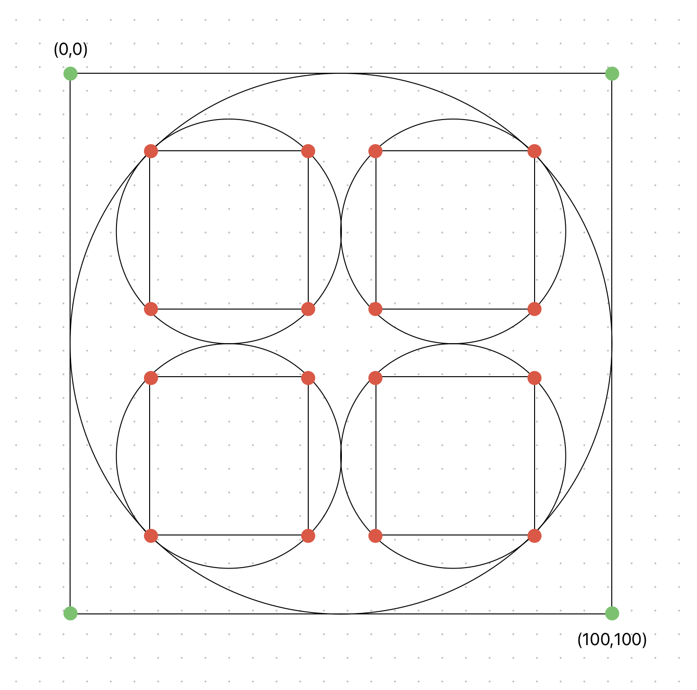

# Rotation Leiden

This is a project inspired by the works of UK artist Kenneth Martin, in this case the work ["Rotation 'Frankfurt'"](https://www.tate.org.uk/art/artworks/martin-rotation-frankfurt-key-drawing-p05475).

Analyzing the image, we have a set of coordinates distributed according to the following drawing. I requested several AI agents to calculate the red dotted coordinates in the drawing I made up front, but they had a hard time. Antrhopic Claude made several mistakes, maybe the thin black lines got lost in a scale down of the image on the server? Gemini 2.5 Pro also made mistakes initially, and eventually I was lucky with ChatGPT-4o.

I've added two additional variations of which the first one is, as far as I understand, a proper second stage when the arrows are followed in the number I variant. The second interpretation is a pure random one, which can be renewed when refreshing the page via a reload.

Vincent Bruijn <vebruijn@gmail.com> (c) 2025
